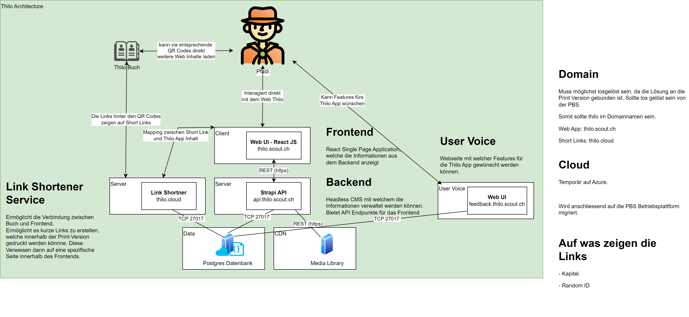

# Thilo - Frontend

Schweizer Pfadibüchlein Thilo, das Original.

The Thilo contains a lot of interesting and useful information about the Scouts and belongs on every Scout's bedside table and in his or her bag. Contents: The scout movement, the world we live in, scout techniques, first aid, nature and the environment, camp life, etc.

The frontend is a static site built with [Astro](https://astro.build): all content is fetched from the Strapi backend at build time and shipped as plain HTML with a small amount of client JavaScript. It is installable as a PWA and fully usable offline after the first visit.

## Big Picture


- **Frontend** (this repo): Astro SSG, deployed to GitHub Pages under the `/thilo/` base path
- **Backend**: [Strapi Backend](https://github.com/scout-ch/thilo-api) at `https://api.thilo.scouts.ch/` (override with the `BACKEND_URL` env var)

Key traits:

- **i18n**: German (unprefixed), French and Italian (`/fr/`, `/it/`) pages are generated per locale; the language switcher maps sections across locales
- **Search**: a web component scoring against a static per-locale index (`/search-index/[locale].json`) generated at build time
- **PWA**: the whole site is precached (Workbox), API responses and images are runtime-cached, and an update prompt appears when a new build is available
- **Quizzes**: the only React islands, hydrated lazily where a chapter links a quiz JSON
- **Dark mode**: light/dark options in the menu, syncing with the system until the user picks explicitly

See [docs/IMPROVEMENTS.md](./docs/IMPROVEMENTS.md) for a detailed change log of the current overhaul, [docs/GAMIFICATION.md](./docs/GAMIFICATION.md) for the progress-tracking and quiz roadmap, and [docs/MOBILE-APP-EVALUATION.md](./docs/MOBILE-APP-EVALUATION.md) for why the mobile strategy is PWA-first instead of React Native/Flutter. `CLAUDE.md` describes the code layout in more detail.

## Development

```bash
pnpm install
pnpm run dev        # dev server at http://localhost:4321
pnpm run build      # astro check + production build to /build
pnpm run preview    # serve the production build
```

The build fetches live content from Strapi, so it needs network access.

## Deployment

Every push to `master` builds the container image and deploys the static site to GitHub Pages (see `.github/workflows/deploy.yml`). For a local container stack:

```bash
docker-compose up -d
```

## Contribute
Willst du mithelfen oder hast einen Verbesserungsvorschlag?
Schaue dir die Issues an oder erstelle ein Neues.
Wir freuen uns über jeden PR.
Bei Fragen kannst du dich an die Betreuungskommission (inhaltlich) oder die IT Kommission (technisch) wenden.

### Content Creation
Der Inhalt für dieses Frontend wird mittels Markdown und HTML erstellt. Zur Zeit
werden JSON Dateien angelegt mittels Strapi die Markdown enthalten.

#### Anleitungen und Cheat Sheets für Markdown:
Die grundlegende Markdown Syntax, die in diesem Projekt unterstützt wird, findet
Ihr auf folgenden Seiten:
- https://commonmark.org/help/
- https://github.github.com/gfm/

#### Projektspezifisches Markdown:
Die Bildgestaltung und die Bildunterschrift können über das Alt-Attribut eines Bildes spezifiziert werden, wie folgt:
```md
[caption: test-image; width: 150px; height: 150px;](location/of/test-image.jpg)
```
Der `caption` tag erlaubt die ursprüngliche alt-tag funktionalität noch zu nutzen. Wichtig ist das trennen von tag Name und Wert mittels `:`, und das abschliessen eines Paars mit `;`. Genau wie bei der Verwendung von [CSS](https://developer.mozilla.org/en-US/docs/Web/CSS).

Alle möglichen HTML Einheiten funktionieren für die `width` und `height` tags (und es können auch andere gültige CSS-Stiltags verwendet werden).

Für weitere Infos, siehe die [Erfassungsrichtlinien](./Erfassungs-Richtlinien.md) des Hering Projekts, auf dem das Thilo basiert.
