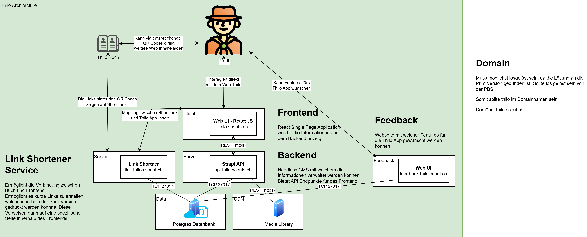

# Thilo - Frontend of Thilo
Schweizer Pfadibüchlein Thilo, das Original.

The Thilo contains a lot of interesting and useful information about the Scouts and belongs on every Scout's bedside table and in his or her bag. Contents: The scout movement, the world we live in, scout techniques, first aid, nature and the environment, camp life, etc.

Frontend written in React.

## Big Picture


## Components
### Frontend
[React Frontend](https://github.com/scout-ch/thilo/tree/master/src)

### Backend
[Strapi Backend](https://github.com/scout-ch/thilo-api)

## Deployment
Run docker-compose.prod.yml file

```bash
docker-compose -f docker-compose.prod.yml up -d
```

Services
- Frontend: http://localhost:3000
- Backend: http://localhost:1337
- SHLINK: http://localhost:8080
- SHLINK ADMIN: http://localhost:8081
- Postgres: localhost:5432
- PgAdmin: http://localhost:5050

## Development
### Environment Variables
None

### Available Scripts
In the project directory, you can run:

### `npm start`
Runs the app in the development mode.\
Open [http://localhost:3000](http://localhost:3000) to view it in the browser.

### `npm test`

Launches the test runner in the interactive watch mode.\
See the section about [running tests](https://facebook.github.io/create-react-app/docs/running-tests) for more information.

### `npm run build`
Builds the app for production to the `build` folder.\
It correctly bundles React in production mode and optimizes the build for the best performance.

## Contribute
Willst du mithelfen oder hast einen Verbesserungsvorschlag?
Schaue dir die Issues an oder erstelle ein Neues.
Wir freuen uns über jeden PR.
Bei Fragen kannst du dich an die Betreuungskommission (inhaltlich) oder die IT Kommission (technisch) wenden.

### Content Creation
Der Inhalt für dieses Frontend wird mittels Markdown und HTML erstellt. Zur Zeit
werden JSON Dateien angelegt mittels Strapi die Markdown enthalten.

#### Anleitungen und Cheat Sheets für Markdown:
Die grundlegende Markdown Syntax, die in diesem Projekt unterstützt wird, findet
Ihr auf folgenden Seiten: 
- https://remarkjs.github.io/react-markdown/
- https://commonmark.org/help/
- https://github.com/remarkjs/remark-gfm#use

#### Projektspezifisches Markdown:
Die Bildgestaltung und die Bildunterschrift können über das Alt-Attribut eines Bildes spezifiziert werden, wie folgt:
```md
[caption: test-image; width: 150px; height: 150px;](location/of/test-image.jpg)
```
Der `caption` tag erlaubt die ursprüngliche alt-tag funktionalität noch zu nutzen. Wichtig ist das trennen von tag Name und Wert mittels `:`, und das abschliessen eines Paars mit `;`. Genau wie bei der Verwendung von [CSS](https://developer.mozilla.org/en-US/docs/Web/CSS).

Alle möglichen HTML Einheiten funktionieren für die `width` und `height` tags (und es können auch andere gültige CSS-Stiltags verwendet werden).

Für weitere Infos, siehe die [Erfassungsrichtlinien](./Erfassungs-Richtlinien.md) des Hering Projekts, auf dem das Thilo basiert.

## Production
The frontend is deployed to GitHub pages.
